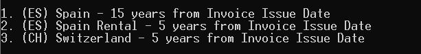

# Limitation date

## Description

Limitation date is a Python script that takes a date of an invoice and returns the limitation date according to the country and type selected.

## Usage
- Make sure you have the latest python version installed to your computer [Python download](https://www.python.org/downloads/).

- Type "cmd" in the File Explorer that **limitation_date.py** is located to open Command Prompt directly in that directory.

- Type command
```python limitation_date.py```
- Select country and type from menu.



- Paste starting date.


## License

[MIT](https://choosealicense.com/licenses/mit/)
